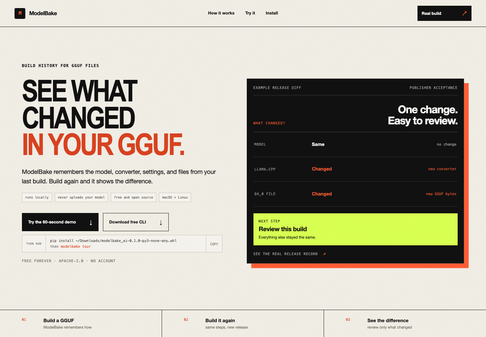
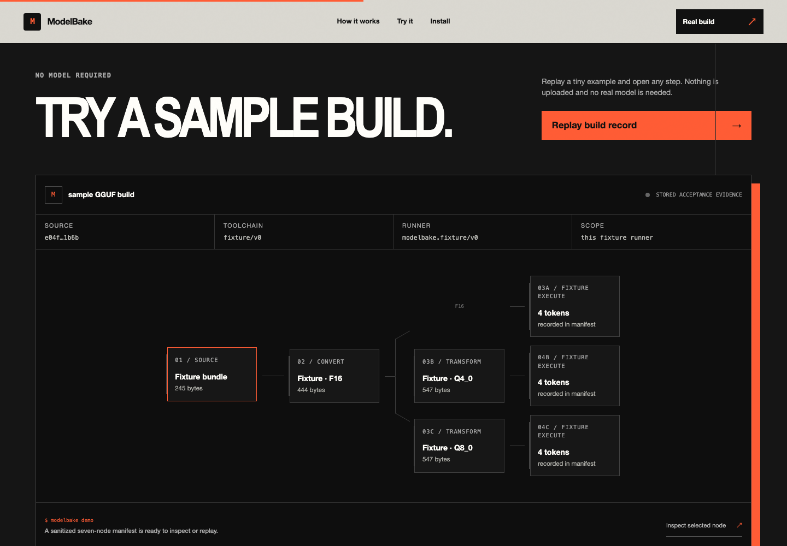

# ModelBake

**Know what changed before you ship the next model.**

ModelBake builds a local Llama checkpoint into GGUF variants and saves how it was
done: source, recipe, tools, outputs, and runner results. Run it again to reuse
unchanged outputs and see exactly what changed.

The first build creates a release record. Every later build can be compared with
the last record your team accepted.

[Website](https://modelbake.dev/) · [Source](https://github.com/Centrista/modelbake) · [Inspect the real build record](https://modelbake.dev/real-evidence.html)





## Why not Git?

Git records repository files and commits. A model release also depends on bytes
that usually live outside Git: the checkpoint, converter executable, Python
environment, runner, and produced GGUFs. ModelBake live-verifies those bytes and
binds the candidate, its exact diff, and the previously accepted release into one
review receipt. If the candidate or predecessor moves after review, acceptance
fails.

You can store ModelBake's portable JSON records in Git. Git remains the source
history; ModelBake supplies the model-release check.

ModelBake is alpha software. Its evidence is deliberately narrow: it tells you which bytes were produced and whether the recorded runner process exited successfully. It does **not** prove model quality, numerical equivalence, compatibility with another runtime, security, license compliance, or production readiness.

```text
local checkpoint
      │
      ▼
   GGUF F16 ───────┬───────────┐
      │            │           │
      │          Q4_0         Q8_0
      │            │           │
      ▼            ▼           ▼
 smoke/F16     smoke/Q4_0   smoke/Q8_0
```

## Why it exists

A checkpoint alone does not capture how a runnable artifact came to be. Conversion flags, tool revisions, executable bytes, quantization choices, host details, and the exact runner invocation all affect the release. Ad hoc scripts leave that lineage scattered across terminals and CI logs.

ModelBake makes the release process one inspectable object:

- a strict recipe with no user-supplied commands;
- a deterministic DAG and content-derived node keys;
- a digest-verifying local cache;
- adapter-generated argv with sensitive prompt values digest-redacted, plus bounded process output;
- an atomic run manifest with explicit evidence limits.
- a manifest comparison that separates recorded output-digest changes, evidence changes, and cache reuse.

## Quickstart: deterministic demo

Requirements: Python 3.11 or newer.

Install the current release directly from ModelBake, then run the complete
recurring-release loop. No model, account, or API key is needed:

```bash
python -m pip install https://modelbake.dev/downloads/modelbake_ai-0.1.0-py3-none-any.whl
modelbake tour
```

On interactive runs, ModelBake checks `https://modelbake.dev/latest.json` at
most once every 24 hours and prints a versioned GitHub release command only when
a newer stable version exists. The request contains no build data, paths, or model information;
like any HTTPS request, the server can observe normal network metadata such as
the IP address and user agent. ModelBake never installs an update automatically.
Set `MODELBAKE_NO_UPDATE_CHECK=1` to disable the check completely. CI and
non-interactive runs never make the request.

That one credential-free command builds a Q4 fixture baseline, builds a Q4+Q8
candidate with the same content cache, and prints the exact release diff. The
fixture proves the workflow, not GGUF or model-runtime compatibility.

To work on ModelBake itself, clone the repository and create a development
environment:

```bash
git clone https://github.com/Centrista/modelbake.git
cd modelbake
python3 -m venv .venv
source .venv/bin/activate
python -m pip install '.[dev]'

modelbake demo --story baseline --run-dir .modelbake/demo-first
modelbake verify .modelbake/demo-first/manifest.json --allow-artifact-root .modelbake/cache
modelbake baseline review .modelbake/demo-first/manifest.json --store .modelbake/baselines --name demo --review .modelbake/demo-first/review.json --allow-artifact-root .modelbake/cache --initial
modelbake baseline accept .modelbake/demo-first/manifest.json --store .modelbake/baselines --name demo --allow-artifact-root .modelbake/cache --review .modelbake/demo-first/review.json --note "first local fixture run"
modelbake baseline check .modelbake/demo-first/manifest.json --store .modelbake/baselines --name demo --allow-artifact-root .modelbake/cache
modelbake demo --story candidate --run-dir .modelbake/demo-second
modelbake verify .modelbake/demo-second/manifest.json --allow-artifact-root .modelbake/cache
modelbake status .modelbake/demo-second/manifest.json
modelbake report .modelbake/demo-second/manifest.json --html .modelbake/demo-second/report.html
modelbake compare .modelbake/demo-first/manifest.json .modelbake/demo-second/manifest.json
modelbake baseline compare .modelbake/demo-second/manifest.json --store .modelbake/baselines --name demo
modelbake baseline review .modelbake/demo-second/manifest.json --store .modelbake/baselines --name demo --review .modelbake/demo-second/review.json --allow-artifact-root .modelbake/cache
modelbake baseline accept .modelbake/demo-second/manifest.json --store .modelbake/baselines --name demo --allow-artifact-root .modelbake/cache --review .modelbake/demo-second/review.json
modelbake baseline check .modelbake/demo-second/manifest.json --store .modelbake/baselines --name demo --allow-artifact-root .modelbake/cache
pytest
```

The demo is credential-free and deterministic. It exercises the graph and cache,
but writes a private fixture format—not GGUF—and makes no `llama.cpp` compatibility
claim. The candidate reuses the baseline's four digest-checked nodes and adds Q8's
two nodes, producing a real recorded release diff.

## Build with a local `llama.cpp` toolchain

Start from [`examples/modelbake.llamacpp.yaml`](examples/modelbake.llamacpp.yaml). Replace its placeholder source with a real local Hugging Face-style Llama checkpoint containing safetensors files. Set every tool to an existing absolute path and replace the revision placeholder with the exact `llama.cpp` revision you built:

```yaml
runner:
  adapter: llamacpp
  name: local-llama-cpp
  timeout_seconds: 1800
  max_log_bytes: 65536
  tools:
    python: /absolute/path/to/python
    convert: /absolute/path/to/llama.cpp/convert_hf_to_gguf.py
    quantize: /absolute/path/to/llama-quantize
    runner: /absolute/path/to/llama-cli
    revision: exact-llama-cpp-commit
```

Then plan before executing:

```bash
modelbake plan path/to/modelbake.yaml
modelbake build path/to/modelbake.yaml
modelbake verify .modelbake/runs/<run-id>/manifest.json --allow-artifact-root .modelbake/cache
```

The revision is recorded as supplied. When the converter is inside a Git checkout,
ModelBake also requires it to match the observed `HEAD`. ModelBake records executable/script
bytes, the configured Python interpreter identity, the versions of the converter's direct
dependencies, and checkout status when available. It checks the
adapter fingerprint again after every execution before committing outputs. Dependency
versions are bounded metadata evidence; ModelBake does not hash or attest every
installed package file.
ModelBake does not fetch or install `llama.cpp`, models, or licenses for you. In
v0, external `llama.cpp` runner lifecycle handling is POSIX-only; Windows is not
a supported external-runner platform.

The packaged v0.1.0 code was exercised end to end against a pinned official
`llama.cpp` checkout and a small local Llama safetensors checkpoint. A cold run
produced both GGUF targets and executed them on the named runner; a repeat run
reused six digest-checked nodes. The current release record is a publisher-generated,
receipt-backed acceptance—not independent attestation—and is available as sanitized
JSON in [`site/dist/real-evidence.json`](site/dist/real-evidence.json). Its scope does
not extend beyond the exact source, tools, host, artifacts, and process observations
recorded there.

## CLI

```text
modelbake plan <recipe> [--json]
modelbake build <recipe> [--run-dir PATH] [--cache-dir PATH] [--resume] [--json]
modelbake demo [--recipe PATH | --story baseline|candidate] [--run-dir PATH] [--cache-dir PATH] [--resume]
modelbake tour [--run-root PATH] [--cache-dir PATH] [--markdown]
modelbake status <manifest> [--json]
modelbake report <manifest> [--json | --html PATH]
modelbake verify <manifest> --allow-artifact-root PATH [--allow-artifact-root PATH ...] [--json]
modelbake compare <before-manifest> <after-manifest> [--json | --markdown]
modelbake baseline review CANDIDATE --store STORE --name NAME --review REVIEW --allow-artifact-root ROOT [--initial]
modelbake baseline accept MANIFEST --store STORE --name NAME --allow-artifact-root ROOT --review REVIEW [--note NOTE]
modelbake baseline check CANDIDATE --store STORE --name NAME --allow-artifact-root ROOT
modelbake baseline current --store STORE --name NAME
modelbake baseline verify --store STORE --name NAME
modelbake baseline compare CANDIDATE --store STORE --name NAME [--markdown | --json]
```

`verify` recomputes the digests of recorded outputs at their manifest paths. It verifies current bytes against the manifest; it does not re-run the toolchain or validate model behavior.

`compare` reports recorded lineage, state, observation, and output-digest differences.
Matching recorded digests, new runner observations, and cache reuse are deliberately separate.
It does not decide that a candidate is safe to promote. See the [optional GitHub
Actions setup](docs/CI_INTEGRATION.md). It vendors the reviewed action, stores cache
and accepted-release memory outside the checkout, and reduces recurring runs to one
workflow button with two explicit release controls. GitHub cache and evidence
upload remain opt-in; the local CLI does not upload either.

`baseline review` live-verifies a candidate and binds its exact bytes, deterministic
comparison, and current accepted predecessor into a receipt. CLI `baseline accept
--review` rechecks that receipt under the ledger lock; it fails if the release or
predecessor changed. `baseline check` requires an exact current receipt-backed
decision and live bytes. The Python API retains unreviewed acceptance only for v1
ledger compatibility; `baseline check` rejects those decisions. None infer quality.
See [Accepted baselines](docs/BASELINES.md).

## Evidence vocabulary

| State | Exact meaning |
| --- | --- |
| `produced` | The adapter returned declared output bytes, which ModelBake copied and digested into the cache. |
| `fixture_observed` | The in-process fixture adapter decoded its private test artifact; no model runtime or subprocess was exercised. |
| `executed_on_runner` | The named adapter launched the recorded runner command and the process returned exit code 0. |
| `cache_hit` | Cached output bytes were found and their digests matched the cache manifest. |
| `failed` | The node did not complete or its cached evidence failed verification. |
| `blocked` | A dependency failed or was blocked, so the node was not executed. |

See [Evidence model](docs/EVIDENCE_MODEL.md) for the complete truth boundary.

## Current scope

The real adapter supports one intentionally narrow POSIX-only route:

- local source only;
- Llama architecture only;
- safetensors only; pickle-backed files are rejected;
- `llama.cpp` conversion to GGUF F16;
- optional F16, Q4_0, and Q8_0 targets;
- local `llama-cli` smoke execution with a fixed seed;
- explicit, existing, absolute tool paths.

Recipes cannot add shell commands, arguments, remote code, or arbitrary graph nodes. Source paths must stay within the recipe directory by default, and symlinks in source trees are rejected.

## Documentation

- [Product and user experience](docs/PRODUCT.md)
- [Architecture](docs/ARCHITECTURE.md)
- [Evidence model](docs/EVIDENCE_MODEL.md)
- [Adapters](docs/ADAPTERS.md)
- [CI release integration](docs/CI_INTEGRATION.md)
- [PyPI trusted publishing](docs/PYPI_RELEASE.md)
- [Accepted baseline API](docs/BASELINES.md)
- [Roadmap](docs/ROADMAP.md)
- [Go-to-market](docs/GO_TO_MARKET.md)
- [60-day moat experiment](docs/MOAT_EXPERIMENT.md)
- [Decision log](docs/DECISION_LOG.md)
- [Contributing](CONTRIBUTING.md)
- [Security](SECURITY.md)

## Status and license

ModelBake is an early local open-source implementation, not a hosted service. There
is no demonstrated moat, retention, or customer value. The hypotheses and explicit
kill criteria are public in [docs/MOAT_EXPERIMENT.md](docs/MOAT_EXPERIMENT.md).

Licensed under Apache-2.0. See [LICENSE](LICENSE).
